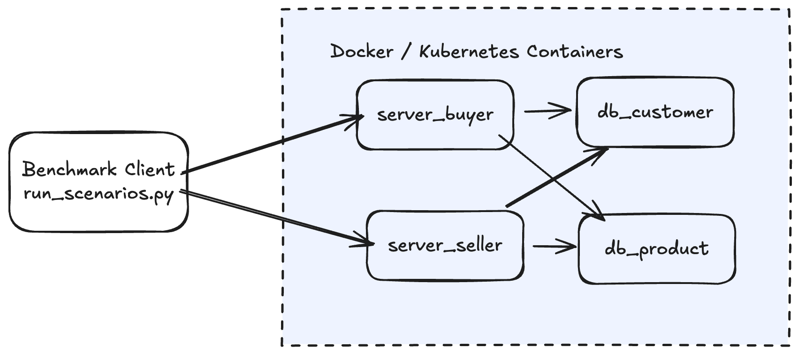

## System Summary

We have built a system which implements an online marketplace with a buyer and seller with four backend services - db_customer, db_product, server_buyer, and server_seller

Clients talk to the buyer and seller frontends, which forward requests to the above services using JSON over TCP - All communication is done on TCP

Each service runs in its own process and can be deployed on separate hosts. For our experiments, we ran it on the same hosts on different ports.

The evaluation script is in scripts/bench. We measure average response time and throughput across many runs (that script is highly modular for testing different scenarios)

We also include lightweight API smoke tests in `tests/` that spin up in-process servers and exercise backend and frontend flows over TCP. These tests cover customer and product DB APIs and buyer and seller frontend APIs, including account creation, login and session validation, item registration and search, cart updates, and feedback, rating paths

Containerization information is present in Dockerfiles for local runs and in `k8s\` for deployment on GCP.

### Benchmark Scenarios

The benchmark script `scripts/bench/run_scenarios.py` runs three predefined load levels: scenario 1 (1 buyer + 1 seller), scenario 2 (10 buyers + 10 sellers), and scenario 3 (100 buyers + 100 sellers). Each scenario repeats multiple runs (10), and each client performs 1000 API calls per run.

Within each scenario, seller clients create accounts, log in, register an item, and then repeatedly toggle the item price (`ChangeItemPrice`). Buyer clients repeatedly call `SearchItemsForSale`. All buyer and seller threads start together, and the script measures per-request latency and overall throughput.

### Performance Report

The performance is analyzed in the [Performance Report File](REPORT.md)

### Stateless Frontend

The buyer and seller frontends are intentionally stateless: they do not keep persistent per-user or cross-request data in memory (e.g., sessions, carts, or item metadata). Any state that must survive reconnects or frontend restarts is stored in the backend databases (customer and product dbs).

### Assumptions 

* Services are reachable on ports 6001–6004
* Docker Compose is used for local deployment, and clients can open enough sockets for concurrency
* Kubernetes and Google Compute Engine is used for deployment on Google cloud
* Network communication is reliable TCP
